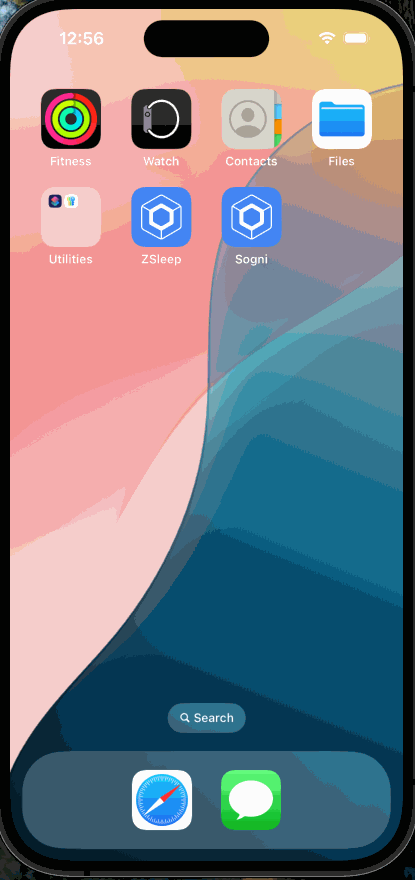

# Sogni app demo

### Technologies

The app uses the following multiplatform dependencies in its implementation:

- [Compose Multiplatform](https://jb.gg/compose) for UI
- [Compose Navigation](https://www.jetbrains.com/help/kotlin-multiplatform-dev/compose-navigation-routing.html)
- [Ktor](https://ktor.io/) for networking
- [kotlinx.serialization](https://github.com/Kotlin/kotlinx.serialization) for JSON handling
- [Coil](https://github.com/coil-kt/coil) for image loading
- [Koin](https://github.com/InsertKoinIO/koin) for dependency injection

> This repo only demo ui without integration with api yet.

Here is demo for ios:

And here for android
